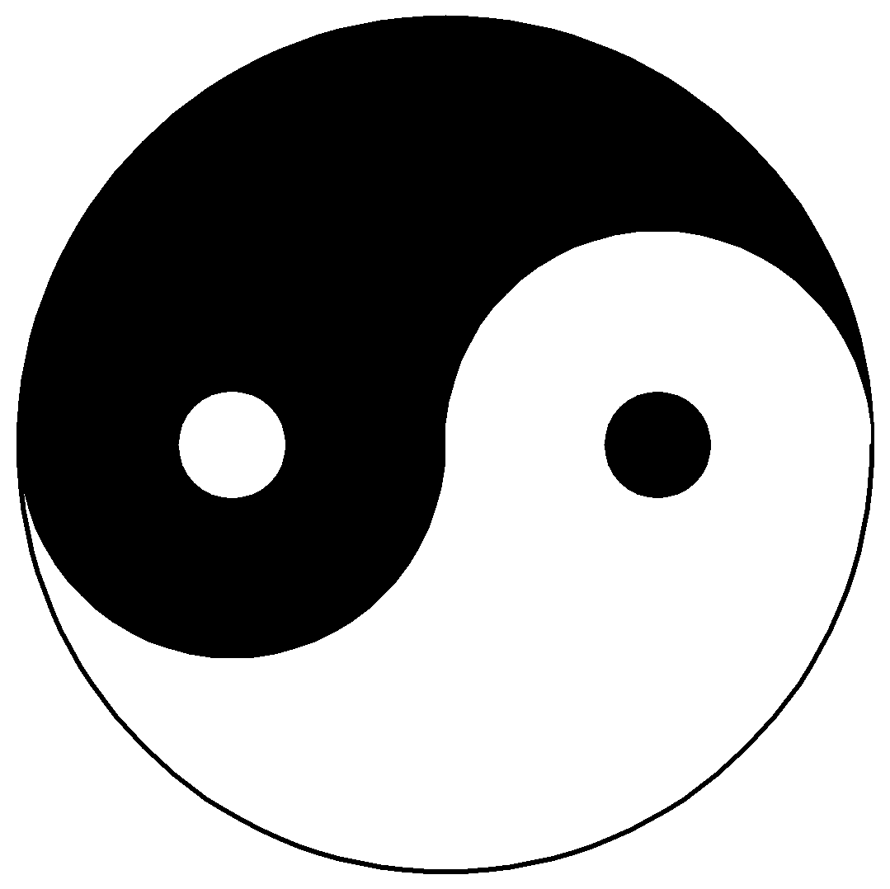

# 世界分析框架
利益，规律(道,周期,定数)

# 人生动力来源基本哲学
他人的利益，伙伴的利益，人生发展动力来源

# 易经：

## 一阴一阳之谓道。

变易：指变化之道，万事万物时时刻刻都在变化。
简易：一阴一阳，囊括了万种事物之理；有天就有地，有上就有下，有前就有后，都是相反相成，对立统一。
不易：虽世间的事物错综复杂，变化多端，但是有一样东西永远不变的，那就是规律；天地运行，四季轮换，寒暑交替，冬寒夏热，月盈则亏，日午则偏，物极必反，这便是规律。

万事万物的发展皆有“定数”与“变数”，定数有规可循而变数无规可循；定数中含有变数，变数中又含有定数，无论定数还是变数其大局皆不变。

# 真理定律
真理掌握在少数人手中，真理即未来，真理肯定是少数人或少数团体得出的一个结论，具有预见性，真理提出时，大多数人都不理解  
真理的反面也是真理  
任何真理都有自己适用的条件，范围，场景  

