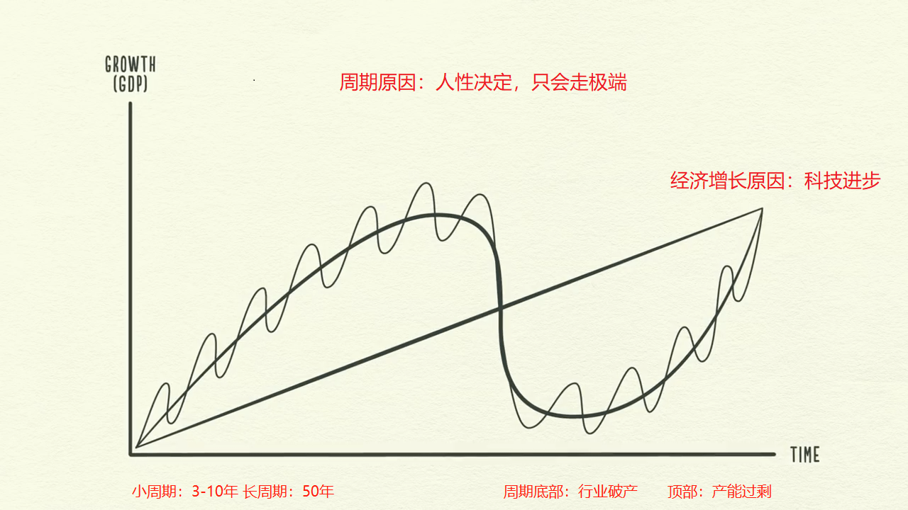
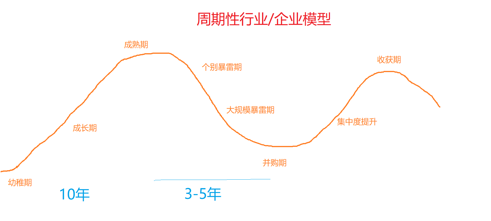
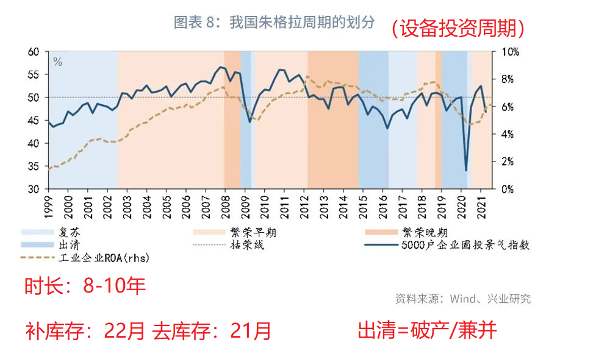

# 投资框架/投资系统/交易系统

# 周期投资模型

# 投资时机（择时）
周期性行业投资： 成熟期 =》 个别暴雷期 =》 集中暴雷期（30%-50%）=》财报暴雷期（财报股息降低期） =》 并购期（行业30-70%玩家退出，买入龙头公司） =》收获期(卖出)

# 买进：
时机：判断行业的周期时长，是否适合买进    
政策：是否政策拐点，政府鼓励  （政策拐点时（表态救市或打压），还需等等，如房地产，市场底部可能会远低于政策底部。市场顶或底，会慢于政策顶底  
供需失衡时买进  
库存拐点时买进  

# 卖出：
泡沫时卖出  
大众抢购时卖出  
大家都乐观时卖出  
供应过剩时卖出  

# 简明框架
经济不好(东西便宜,低买)  =》 经济好(东西贵,高卖)  
等行业破产时买进（行业并购） =》 泡沫时卖出 （此条买进有风险，可定投买进分散风险）  
大众绝望时买进 =》 大众乐观，抢购时卖出  （此条买进有风险，可定投买进分散风险）  
政策拐点时买进 =》 政策拐点时卖出  (此条有风险，政策拐点买进有点早，如2021年地产，12月救市，2023年4月才救活。)  
业绩拐点时买进 =》 业绩拐点时卖出（此条需要找到供需的关键指标）  
商品低于成本时关注 =》 商品远高于成本时卖出（此条风险：一般需要等行业破产，产能出清，才能买进）
供需失衡时买进 =》 供应充足时卖出（找到关键数据：如房地产房屋销售面积，猪行业的母猪数量）  
买在无人问津处 =》 卖在人声鼎沸时  
基金叫好时卖出 =》 基金都在骂时买入  
大家不关注市场的时候关注市场 =》 在市场沸腾的时候抵制诱惑，离开市场  

# 估值：
一般行业危机，破产时买入  
港股估值会跌至PB=0.05-0.1, 美股PB=0.1-0.2  

# 时间长度：
短周期至少：3-5(根据企业库存周期)  
长周期：10年(设备10年左右需要损坏更新)  
周期投资：80%时间在等待，确定性机会再出手  

# 投资逻辑 / 投资原理
周期投资=择时=天时(宏观)+地利+人和(投资者情绪)
股市投资是反人性的，需要逆向思维，与大家思考不一样，因为大多数人的状态是：瞎投资
人性特点：90%的人不喜欢思考，人云亦云，跟风行动，羊群/从众效应，趋利避害。  
容易恐慌（引发抢购，引发抛售）。(注：2020-4-20因为新冠疫情，油价跌成负数（每桶-37.63美元），可见人类之疯狂）  
情绪波动大，买涨不买跌，越跌越恐慌（提升观望情绪）。  
人性本质只会走极端，过于乐观或过于悲观。  
人性不变，历史会一次次出现。不会走直线，只会走波浪线，循环向上  
普通投资者经常说：这次不一样  
长期持有=风险累积，持有时间越长，一个行业或公司的风险越大

# 周期投资-风险处理
1. 判断行业会不会消失,或被替代，公司会不会被替代  
2. 行业赛道投资，投资行业TOP1-2  
3. 寻找业绩拐点，政策拐点再投资  
4. 供需失衡时，再投资  
5. 信用风险，高杠杆，出险企业容易倒闭，直接归零（尤其金融行业：银行，保险）。 
6. 行业投资不可以超过30%（此项会降低收益率）

# 周期公式

周期时间长度： 如3-5年，权重：30%  
行业成本：20%,低于行业成本运行时长  
企业库存及需求拐点：50%  

# 小故事
等待拐点确认，等待投资确定性（行业数据转好），再买进（股市领先市场通常2-6个月，也有可能滞后）  
	失败小故事：2019年1月7日，工厂正式开工建设，特斯拉上海工厂2019年12月30日投产，股价在：2019-10月上涨30%，提前2个月反映  
	个人失败原因：2019年初买进特斯拉（过早买进），持有2月，被振荡卖出特斯拉，失败赚10倍的股票。  
过早买入，全仓买入
	2022年4月房地产政策拐点买进，但疫情危机，年底发生断贷事件，房地产跌到低点。港股过早买进地产股，全仓买进，下跌了60%

