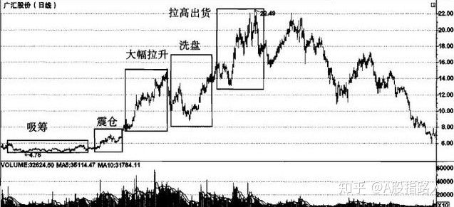

#庄家操盘五步曲

# 庄家控盘手法

#炒作股票目标：
要有炒作概念，（利好）
炒作手法：前期潜伏，利好兑现出货

#1.目标价值以下低眼筹码阶段

所谓的目标价位也就是说散户在买 人股票时，已经给这一个股票定好了一个盈利目标价位，一旦股票的价格达到这一目标价位，散户便抛出股票。庄家坐庄必须吸筹，只有控制了足够的筹码，仓位达 到了一定比例，通常为10％-30％，庄家才能够操纵股价，才能有货用来洗盘、震仓。在这一阶段，庄家往往极耐心地、不动声色地收集低价位筹码，这部分筹 码是庄家的仓底货，是庄家未来产生利润的源泉，一般情况下庄家不会轻易抛出。这一阶段的每日成交量极少且变化不大，分布均匀。在吸筹阶段末期，成交量虽有 所放大，但并不很明显，股价呈现为不跌，或即使下跌也会很快被拉回，但上涨行情并不会立刻到来。因此，此阶段散户应观望为好，不要轻易杀人，以免资金冻结。

#2.试盘眼货与震台打压并举阶段

庄家在低位吸足了筹码之后，在大幅拉升之前，不会轻举妄动，庄家一般先要派出小股侦察部 队试盘一番，将股价小幅拉升数日，看看市场眼风盘多不多、持股者心态如何。在各种条件都具备的市场环境中，庄家想要对某一支股票进行吸货操作时，一般先会 试盘，庄家试盘的目的是了解该股筹码的分布情况，以及市场对该股的关注程度（也就是所谓股性），看看该股是否已经有别的庄家潜伏在内，同时还可以吸进筹 码，用于日后正式吸货时打压股价。震仓是为了吓出意志不够坚决的跟风盘，庄家用少量的筹码打压股价，为日后的拉升降低成本。因此，打压震仓不可避免。在庄 家打压震仓的末期，散户的黄金建仓机会到来了。此时，成交量呈递减状况且比前几日急剧萎缩，表明持股者心态稳定，看好后市，普遍有惜售心理。因此，在打压 震仓末期，散户可趁K线为阴线、跌势最凶猛时进货，通常可买在下影线部分，从而抄得牛股大底。

#3.洗盘阶段

庄家为了减轻在后继拉高中的抛盘压力，要对盘面的获利盘、套牢盘、止损盘进行清洗，同时抬高其他短线介人资金的成本，使抛盘压力降到最低程度， 以便达到顺利拉升的目的。洗盘阶段伴随着大幅拉升阶段同步进行，每当股价上一个台阶之后，庄家一般都会洗一洗盘，一则可以使前期持筹者下车，将筹码换手， 提高平均持仓成本，防止前期持筹者获利太多，中途抛货砸盘，使庄家付出太多的拉升成本；二则提高平均持仓成本对庄家在高位抛货离场也相当有利，不至于庄家 刚一出现抛货迹象，就把散户吓跑。洗盘时成交量是逐渐萎缩的，这说明市场中并没有大量的筹码暗中出逃，股价的波动幅度会越来越小，这表明庄家不愿意提供差 价给短线跟风盘去赚取利润，一般在洗盘过程中，30日移动平均线会呈上涨趋势。

#4. 大幅控盘阶段

庄家为了吸引 散户追涨以减少拉升成本，一方面会利用传闻或舆论大力散布朦胧的利多消息，引起散户关注；另一方面会通过操纵股票价格，作出良好的技术形态，以吸引技术派 人士眼进，同时通过对敲的方法自买自卖造成放量向上突破态势。庄家的拉台加上散户的追涨，造成尾市抢盘，股价节节升高，步入主升期。一般拉升会分为以下几 个阶段。

（1）初级拉高：这一阶段初期的典型特征是成交量稳步放大，股价稳步攀升，K线平均线系统处于多头排列状态，或即将处于多头排列状态，阳线出现次数多于阴线出现次数。如果是大牛股则股价的收盘价一般在5日平均线之上，平均线托着股价以流线型向上延伸。

（2）中期拉高：这一阶段的典型特征是，伴随着一系列的洗盘之后，股价上涨幅度越来越大，上升角度越来越陡，成交量越放越大。若成交量呈递减状态，那么，庄家要么在高位横盘一个月左右慢慢出货，要么利用除权使股价绝对值下降，再拉高或横盘出货。

（3）末期拉高：当个股的交易温度炽热，成交量大得惊人之时，大幅拉升阶段也就快结束了，因为买盘的后续资金一旦用完，卖压就会倾泻而下。因此，散户在此阶段后期的交易策略是坚决不买进，如果持筹在手，则应时刻伺机出货。

#5.抛货离场阶段

此阶段K线图上阴线出现次数增多，股价正在构筑头部，买盘虽仍旺盛，但已露疲弱之态，成交量连日放大，显示庄家已在派发离场。因此，此时果断出仓，就成为散户离场的最佳时机，而此阶段跟进者则将冒九死一生的风险，实属不智之举。
