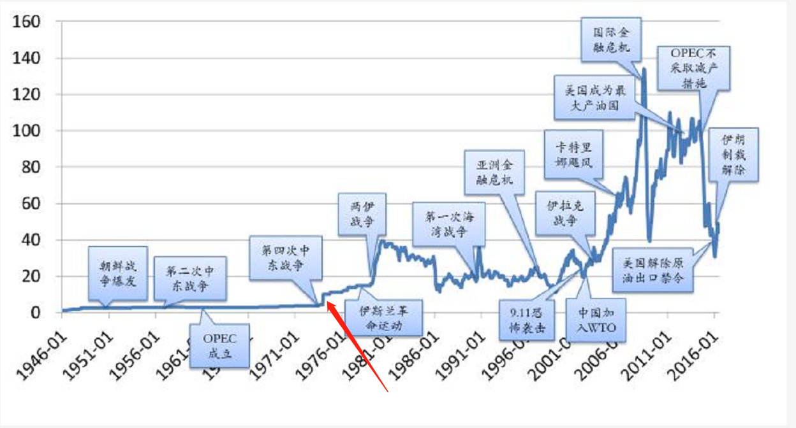

第一次石油危机，1973年10月16日，第一次石油危机爆发。由于1973年10月第四次中东战争爆发，石油输出国组织(OPEC)为了打击对手以色列及支持以色列的国家，宣布石油禁运，暂停出口，造成油价上涨。当时原油价格从1973年的每桶不到3美元涨到超过13美元，是20世纪下半叶三大石油危机之一。

这场禁运于1974年3月18日结束

[第一次石油危机 - 百度百科](https://baike.baidu.com/item/%E7%AC%AC%E4%B8%80%E6%AC%A1%E7%9F%B3%E6%B2%B9%E5%8D%B1%E6%9C%BA/6816315)

# 国际油价

