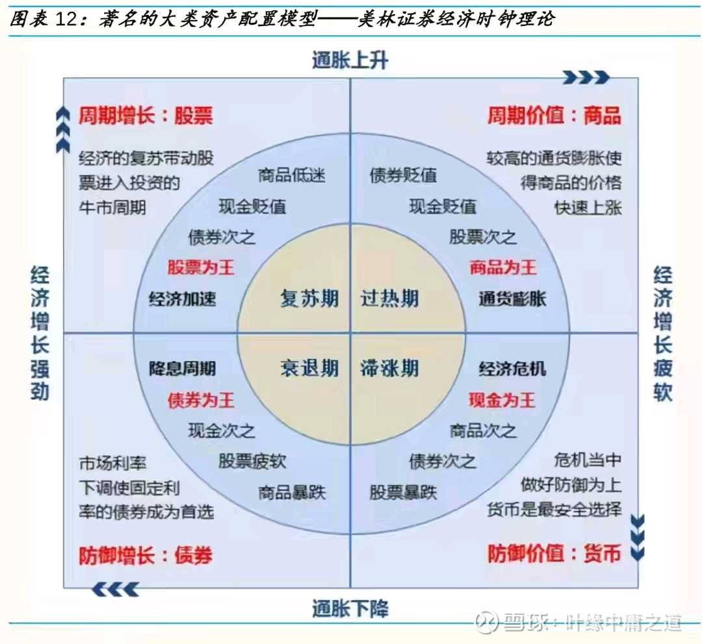
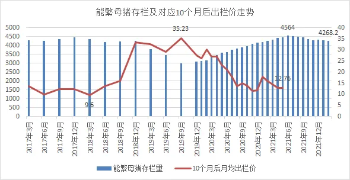

# 商品涨价基本原理
商品短缺 =》 引发抢购 =》 价格暴涨 =》 企业增产 =》 抢购库存积压 =》 库存待消化 =》价格下跌 =》 商品过剩
商品：原油，食品，煤炭,等

# 周期循环
复苏：下游 =》 中游 =》 上游
衰退：下游 =》 中游 =》 上游
下游行业: 地产，汽车，基建，机械、装备制造
中游行业: 加工制造业： 化纤、非金属矿制品、有色金属冶炼压延、黑色金属冶炼压延等中游
上游行业: 有色、石油、煤炭、石化

# 政治周期
一届5年，2届10年，2023年起点。为了换届或交漂亮答卷，2022年会做好数据，换届前一年(2021)会做差数据

# 行业产能周期
产能不足 =》 商品价值高企 =》 投资扩产 =》 产能过剩 =》 破产重组 =》 产能不足

# 企业/行业/新赛道生命周期
初创期 =》 成长期 =》 成熟期 =》 衰退期

# 大宗商品周期
跟货币超发相关，货币超发，则PPI上涨，大宗商品涨价。 升息时利空大宗商品（经济收缩）

# 美林周期
* 衰退 =》 复苏 =》 过热 =》滞涨 
* 货币超发 =》 经济复苏 =》 过热 =》 货币紧缩 =》 经济衰退
* 大宗商品 =》 地产/基建 =》 成长股 =》 现金 

# 股市投资周期
上游：地产，基建 =》 家电 =》 升息（保险） =》 降准，升息（成长股）=》 滞涨（现金） =》衰退（现金） =》

# 企业库存周期
商品缺货 =》 经销商抢购 =》 经销商库存积压 =》 企业库存积压 =》 企业去库存 =》 商品过剩 =》 生产减少
去库存时长，各个行业不同
阿胶：产品涨价10年，去库存：5年，2019年 =》 2023年
茅台：产品涨价8年（2014-2022），造成经销商产生大量库存，去库存：2022 - ？

#房地产周期
政策市，由国家政策决定，是大部分行业周期之母

# 猪周期
： 3-5年，核心指标：母猪数量：4100万头合理，高点4500万头，低点：3000万头，10个月后猪仔上市

# 保险行业周期
跟降息升息周期一致，因为保险浮存金，升息赢利增长，降息赢利减少
保险行业发展与GDP发展呈现高度的相关性，保费增速曲线与GDP增速曲线拟合程度较高

# 钢铁行业周期
跟基建周期一致

# 基建周期
8-10年，并且可能最终消失，跟政治周期相关

# 家电周期
大家电跟房地产周期一致，小家电周期性弱点，也相关

# 可选消费周期
汽车，手机，高端白酒属于可选消费，经济增长放缓时，消费会快速减少

# 快消品周期
跟企业商品价格涨价周期相关，商品可以涨价，则企业赢利快速增长

# 防御性产业
榨菜，经济衰退时，吃榨菜

#证券周期
牛市启动标志，率先上涨的行业

#汽车周期

#银行周期
跟升息降息周期相关，主要挣息差
升息利好银行，息差扩大
降准利好银行，增加放贷规模

#航空周期
跟油价周期相关，油价涨，航空赢利下降，油价跌利润涨。 并且跟汇率强相关

#LED面板周期
跟电视周期及产能投资周期强相关，3-5年
液晶面板涨价周期最长：13个月

# 光伏周期
跟国家政策周期及产能周期相关

# 芯片/半导体周期
跟产能投资周期相关
三波叠加：
1、短期看：价格周期，又称为库存周期，由供给主导，一般为2年左右
2、中期看：创新周期，一般由3～5年的底层创新驱动，比如4G、5G、智能手机、智能电车
3、长期看：国产替代，这是中国半导体公司的最主要矛盾和未来增长的核心驱动力，预计将维持10年左右。

# 白酒行业周期
3-5年（与房产周期一致），可以连续涨价8年，与经销商库存及开瓶率相关。 茅台开瓶率：36%，五粮液：50%

# 国际关系周期:
好=》利益冲突=》坏=》缓和 =》 好
新领导人上台，或是共同利益增长，关系会缓和

# 人口周期
22年大学毕业,根据婴儿潮确定周期，2020年婴儿减少（因为疫情），2042年，毕业生减少

# 房贷周期
20 - 30年

# 企业新业务/转型周期
3 - 5年才有效果

# 医药行业
创新药周期：20年
仿制药周期：1-2年，谁先仿制
中药周期：跟涨价周期一致

# 互联网行业
与大经济周期一致，主要关注MAU（每月活跃用户）及市场份额

# 技术周期
新的技术，拉动投资，如2G，3G，4G，5G技术过渡阶段，通信运营商（移动）拉动产业投资，带动中游（华为，中兴），上游（零配件）
新的技术，新能源电池，新能源汽车，拉动产业投资

# 价格周期

