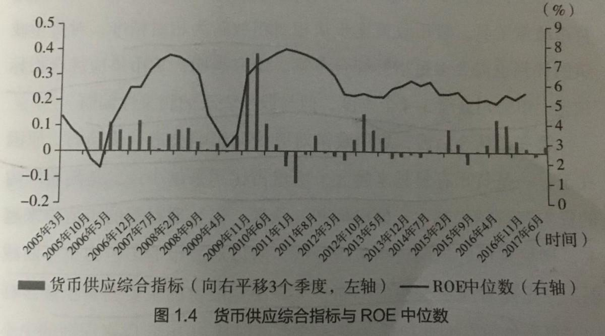

#领先指标：
## 国家宏观领先指标：
大盘领先指标：政策（稳健，积极，紧缩财政政策）+ M2  
M2领先指标： 银行同业拆借利率， M2超发领先实体经济/股票市场6个月  
社融指标：融资  
利率：降低利率可以刺激经济，增加利率，增加借贷成本，降低经济  
新订单，新出口订单: 代表需求  
国家统计局，消费数据及分类  
广告公司的收入  
证券公司（牛市启动器，熊市感知器）  
国家统计局: 工业增加值，利润  

## 货币信贷领先经济通常3-4季度

## 供应：
PPI：企业成本价格，提升对上游企业有利，对下游不利，增加成本
PMI:采购经理指数，领先于季度GDP

## 需求
CPI：企业销售价格，提升对企业下游有利
消费指数：不同行业的销售同比增长

## 企业领先指标：
企业库存周期：预付款
企业存货：代表供需是否正常，存货大幅增加，代表需求萎缩。大幅减少，供求旺盛
企业预付款：大幅增加，代表会损失利润，因为高价买进原材料
企业预收款：大幅增加，代表产品供不应求
企业投资：投资加大，代表未来营收，利润会加大（也可能产能过剩）

## 股市领先指标 
港股，平时领先几个月。牛市顶领先1个月
美股板块

# 大牛市判断指标
时间：平均8年一个牛市
货币：宽信用 + M2持续货币放水
经济危机：有经济危机，更容易牛市，政府会逆周期救市

# 经济滞后指标
经济滞后指标是指经济发展变化的反应滞后于经济活动的实变化，需要一段时间才能反映当前的经济状况，通常被用来确立经济周期的峰值和低谷。

物价CPI，失业率，就业率
工业生产、投资、发电量

## 失业率
失业率通常在经济恶化后才上升，在经济复苏后才回落。

## 债务违约率
在经济衰退期间，企业和消费者的负债增加，可能导致债务违约。因此，债务违约率通常在经济活动恶化之后反应出来。

## 收益率曲线
短期与长期利率之间的倒挂往往被认为是经济衰退的先兆，但它需要一段时间才能形成。

## 零售销售额
由于消费者信心和消费者信任对于经济活动的推动具有重要作用，所以零售销售额的增长通常可能会落后于经济活动的实际增长。

## 存货水平
企业通常会根据市场需求和销售预期来设定存货水平。在经济活动增长期间，企业可能会增加存货水平以满足潜在需求，但如果市场需求未能达到预期，这些额外的存货可能会导致滞胀，从而影响经济增长。

## 房地产销售

## 工业生产指数
